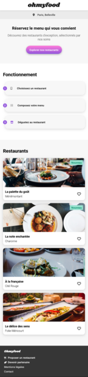
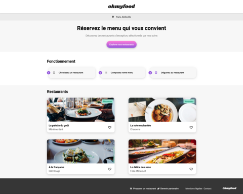

# OpenClassrooms - Ohmyfood

This is my solution for the fourth OpenClassrooms project - Web integrator journey : Ohmyfood

## Table of content

- [overview](#overview)
    - [The project](#the-project)
    - [Screenshot](#screenshot)
    - [Links](#links)
- [My process](#my-process)
- [Skills evaluated](#skills-evaluated)

## Oveview

### The project 

Ohmyfood is a young online meal ordering startup. It is specialized in gastronomic restaurants menus.
Their concept : allow plateform users to compose their own menus in advance. And so, decrease the waiting times in restaurants.
The startup has already developed this concept in New-York and now wishes to export it to Paris.

For the first stage of this project, the goal was to have a first web site working version with CSS animations and responsive design.

### Screenshot

### Links

    - Solution URL: [My github solution here](https://github.com/Amalynn/oc-iw-p4-ohmyfood.git)
    - Live site URL: [My live site here](https://amalynn.github.io/oc-iw-p4-ohmyfood/)

## My process

This project was built with :

    - Mobile-first approach
    - HTML5
    - CSS3
    - Sass : dart-Sass version 1.56.0
    - npm: version 9.5.0
    - NodeJS : version 18.14.0

## Skills evaluated

- Integrate a mobile-first mockup
- Implement CSS animations
- Version the project with Git and GitHub
